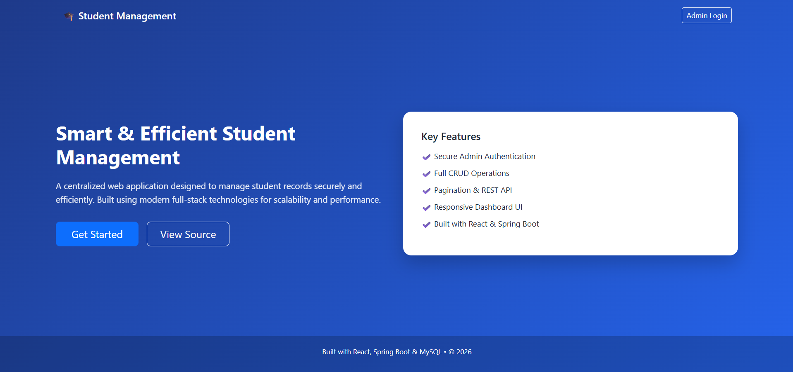
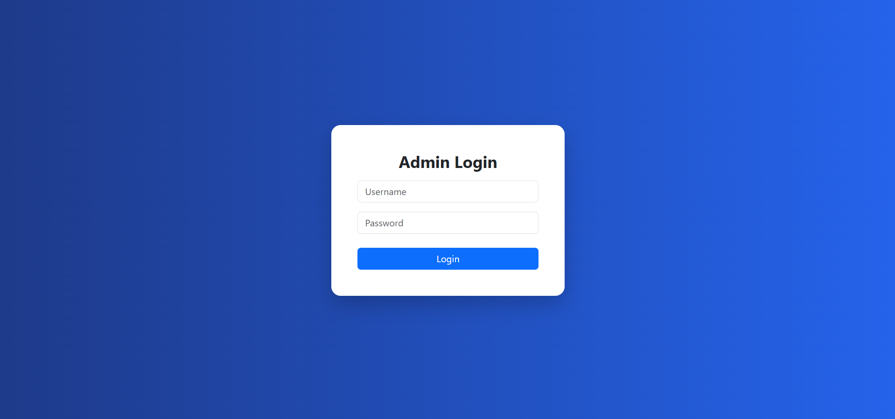
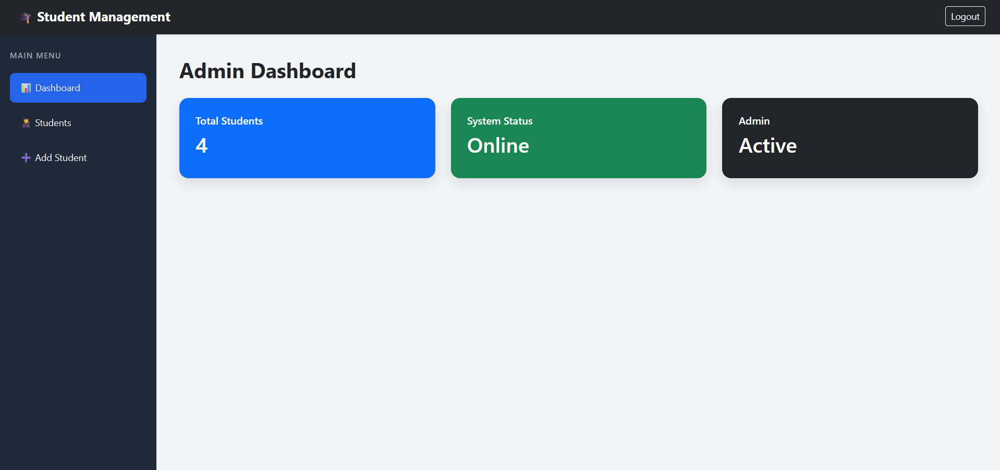
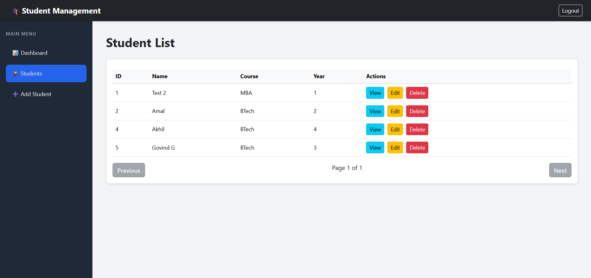
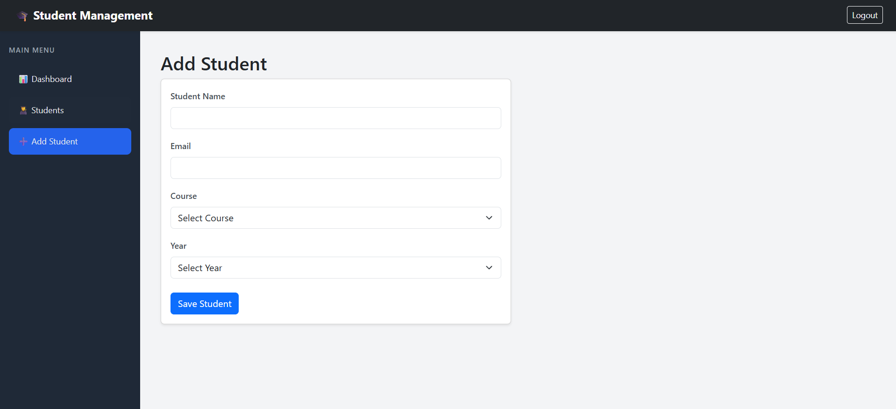
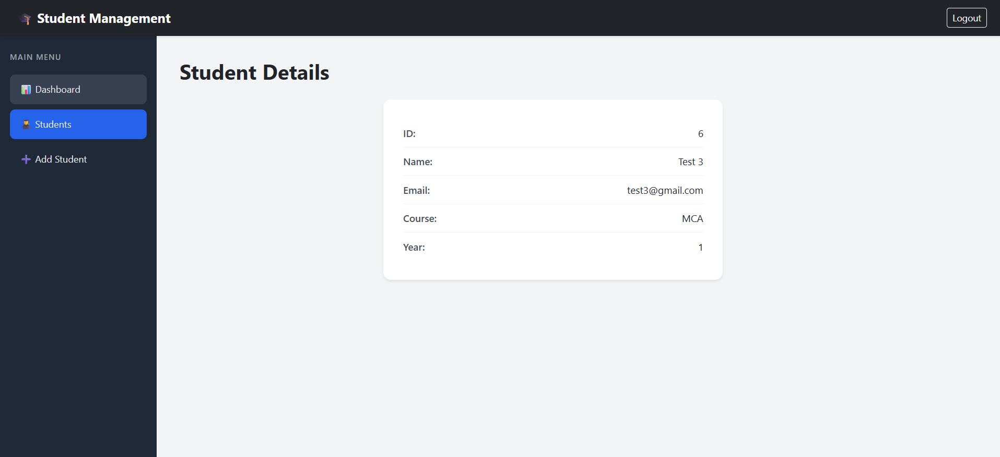

# Student Management App

A full-stack Student Management Application built with **Spring Boot** (REST API) and **React.js**, featuring CRUD operations, admin authentication, and student data management with a **MySQL** database.

Live Demo: [Student Management CRED Application](https://student.akhilrt.com)

---

## Features

- Secure Admin Authentication (Login / Logout)
- Full CRUD Operations — Add, View, Edit, Delete students
- Paginated Student List
- Admin Dashboard with live stats
- REST API backend with Spring Boot
- Responsive UI built with React.js

---

## Tech Stack

| Layer      | Technology                        |
|------------|-----------------------------------|
| Frontend   | React.js                          |
| Backend    | Spring Boot (Java)                |
| Database   | MySQL                             |
| Styling    | CSS                               |
| Deployment | Vercel (Frontend)                 |
|            | Render (Backend)                  |
|            | Railway (MySQL Database)          |

---

## Getting Started

### Prerequisites

- Java 17+
- Node.js 18+
- MySQL 8+
- Maven

---

### 1. Clone the Repository

```bash
git clone https://github.com/iakhilrt/student-management-app.git
cd student-management-app
```

---

### 2. Backend Setup (Spring Boot)

```bash
cd backend
```

Configure the database in `src/main/resources/application.properties`:

```properties
spring.datasource.url=jdbc:mysql://localhost:3306/student_db
spring.datasource.username=your_username
spring.datasource.password=your_password
spring.jpa.hibernate.ddl-auto=update
```

Run the backend:

```bash
mvn spring-boot:run
```

Backend runs on: `http://localhost:8080`

---

### 3. Frontend Setup (React)

```bash
cd frontend
npm install
npm start
```

Frontend runs on: `http://localhost:3000`

---

## API Endpoints

| Method   | Endpoint                  | Description              |
|----------|---------------------------|--------------------------|
| `POST`   | `/api/auth/login`         | Admin login              |
| `GET`    | `/api/students`           | Get all students (paged) |
| `GET`    | `/api/students/{id}`      | Get student by ID        |
| `POST`   | `/api/students`           | Add a new student        |
| `PUT`    | `/api/students/{id}`      | Update student           |
| `DELETE` | `/api/students/{id}`      | Delete student           |

---

## Database Setup

```sql
CREATE DATABASE student_db;
```

Spring Boot will auto-create the required tables on first run.

---

### Environment Variables

Create a `.env` file inside the `frontend/` directory:
```dotenv
VITE_API_URL=http://localhost:8080
```

> For production, replace with your Render backend URL:
> `VITE_API_URL=https://your-app.onrender.com`

---

## Project Structure
```
student-management-app/
├── backend/
│   ├── src/
│   │   └── main/
│   │       ├── java/com/studentapp/
│   │       │   ├── controller/
│   │       │   ├── model/
│   │       │   ├── repository/
│   │       │   └── service/
│   │       └── resources/
│   │           └── application.properties
│   └── pom.xml
├── frontend/
│   ├── src/
│   │   ├── components/
│   │   ├── pages/
│   │   └── App.js
│   ├── .env
│   ├── package.json
│   └── vercel.json
└── README.md
```

---

## Screenshots

### Landing Page


### Admin Login


### Dashboard


### Student List


### Add Student


### Student Details


---

## License

This project is open-source under the [MIT License](LICENSE).

---

## Author

**Akhil RT** — [@iakhilrt](https://github.com/iakhilrt)
